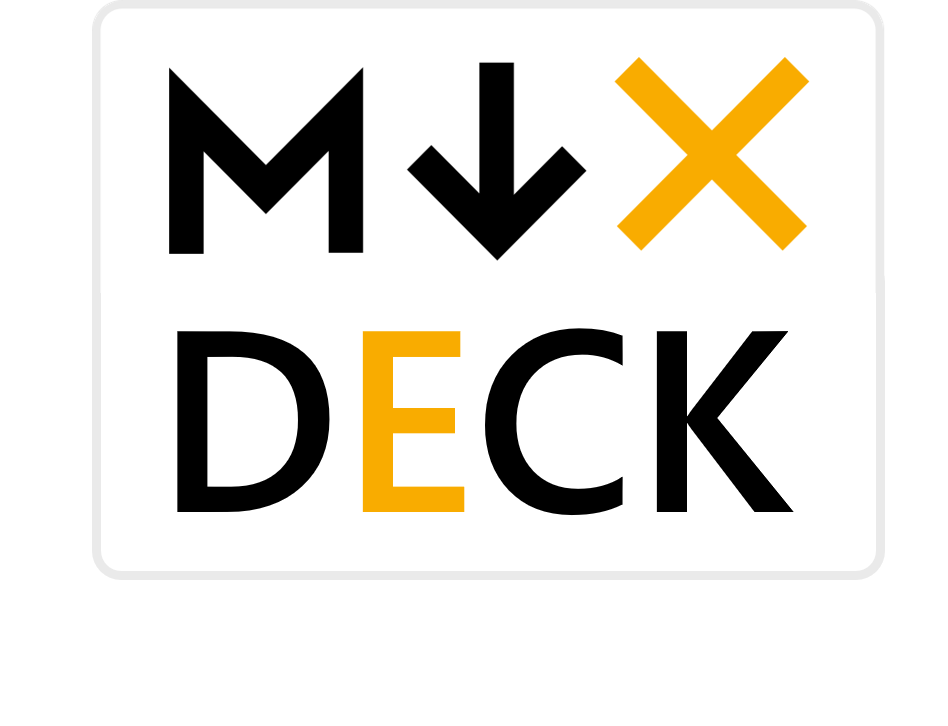
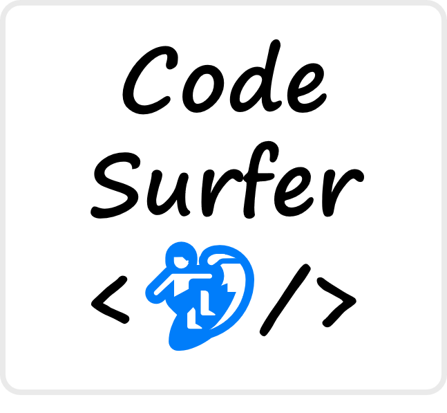

export { default as theme } from './components/theme'
import { Appear, Head, Notes, Image } from 'mdx-deck'
import { Invert, Split, FullScreenCode } from 'mdx-deck/layouts'
import { CodeSurfer } from 'mdx-deck-code-surfer'
import nightOwl from 'prism-react-renderer/themes/nightOwl'
import Box from 'superbox'
import styled from 'styled-components'
import {
  BGImage,
  Counter,
  LayoutMarkdown,
  LayoutAlignCenter,
  IFRAME,
  Sm,
  Avatar,
} from './components'


<Head>
  <title>MDX-DeckとCode Surferでスライドを作ろう！ #WEBエンジニア勉強会11</title>
</Head>


<h1>
  <span>MDX-Deck</span><Sm>と</Sm><span>Code Surfer</span><Sm>で</Sm><br/>
  <span>スライド<Sm>を</Sm>作ろう！</span>
</h1>

<hr/>

##### 2019/2/1　[WEBエンジニア勉強会 #11](https://web-engineer-meetup.connpass.com/event/115444/)

##### [@inouetakumon](https://twitter.com/inouetakumon):tomato:

###### このスライドのソースは[コチラ](https://github.com/Takumon/mdx-deck-sample)

<hr/>

---
export default LayoutAlignCenter

## 自己紹介

<Avatar />

* 名前：たくもん([@inouetakumon](https://twitter.com/inouetakumon))
* 仕事：SIer
* 言語：Java、JavaScript
* 趣味：[ブログ](https://takumon.com)、[Qiita](https://qiita.com/Takumon)

---
export default LayoutAlignCenter

### [たくもんブログ :tomato:](https://takumon.com)

<small>GatsbyJS製。週１で更新してます。</small>

<iframe 
  style={{
    width: '90vw',
    height: '75vh',
    background: 'white',
  }}
  src={'https://takumon.com'}
  ></iframe>

---

ここから本題

---
export default LayoutMarkdown

##  スライド作成ツールはいろいろあるけれど...

* PowerPoint
* Keynote
* [Reveal.js](https://revealjs.com/)
* [Remark.js](https://remarkjs.com/)

---

export default Invert

# 選択肢の1つとして

<br/>




<br/>

# いかがでしょうか！

---

export default Invert

# このスライドも

<br/>

# MDX-Deck

<br/>

# 使ってます✨

---
export default LayoutAlignCenter

#### MDX-DECKは[MDX](https://github.com/mdx-js/mdx)ベースのスライド作成用Node.jsライブラリ


---

export default LayoutMarkdown

## 🤔 MDXとは

1. MarkdownとJSXの記法を組み合わせた技術
1. マークダウンファイルの中にReactコンポーネントが書ける！


---
export default LayoutMarkdown

## 🤔 MDX-DECKとは

1. [MDX](https://github.com/mdx-js/mdx)ベースのスライド作成用Node.jsライブラリ
1. めんどくさい設定不要
1. MDXファイルだけでスライドが作れる
1. Reactコンポーネントでリッチなスライドが作れる
1. リッチなソースコードプレビューが可能なプラグイン(Code Surfer)がある


---

export default LayoutMarkdown

## 始め方も簡単！<br/> [MDX](https://github.com/mdx-js/mdx)ファイル１つでスライド完成！

1. npm i -D mdx-deck
1. MDXファイル作成
1. package.jsonに起動スクリプト追加
1. npm start
1. `http://127.0.0.1:8080` にアクセス！

---
export default LayoutAlignCenter


<CodeSurfer
  title={() => (<h2>サンプル<span style={{color: '#f46f55'}}>.mdx</span></h2>)}
  lang='markdown'
  theme={nightOwl}
  dark={false}
  code={require('!raw-loader!./snippets/sample-slide.mdx')}
  steps={[
    { notes: ''},
    { notes: () =>  (<h3>ファイルの拡張子は<span style={{color: '#f46f55'}}>.mdx</span></h3>)},
    { range: [5, 9], notes: () =>  (<h3>マークダウン記法が使える</h3>) },
    { range: [15, 23], notes: () =>  (<h3>Reactコンポーネントも使える</h3>) },
    { lines: [3, 11, 23], notes: () => (<h3><span style={{color: '#f46f55'}}>---</span>で改ページ</h3>) },
    { notes: ''},
  ]}  
/>


---

export default LayoutAlignCenter

<BGImage  opacity={1} src={require("file-loader!./images/themes.png")}/>

---

export default LayoutAlignCenter

<BGImage  opacity={0.3} src={require("file-loader!./images/themes.png")}/>


# 豊富なテーマ


```jsx
export { dark as theme } from 'mdx-deck/themes'
```

###### 参考：https://github.com/jxnblk/mdx-deck/blob/master/docs/themes.md


---
export default LayoutMarkdown

## 🔧 スライド用のコンポーネント

1. 画像の全画面表示
1. 左右分割レイアウト
1. 色反転レイアウト
1. ソースコードの全画面表示
1. アニメーション
---

export default LayoutAlignCenter

### `Image`：画像の全画面表示 

```jsx
import { Image } from 'mdx-deck'
<Image src='./images/sample-background.jpg' size='cover'/>
```

#### プレビューは次ページ:arrow_right:


---

<Image src='./images/sample-background.jpg' size='cover'/>


---

export default LayoutAlignCenter

### `Split`：左右分割レイアウト

```jsx
import { Split } from 'mdx-deck/layouts'
export default Split


### スプリットレイアウト
ほげほげふがふがぴよぴよ
```

#### プレビューは次ページ:arrow_right:

---
export default Split


### スプリットレイアウト

ほげほげふがふがぴよぴよ


---

export default LayoutAlignCenter

### `Invert`：色反転レイアウト

```jsx
import { Invert } from 'mdx-deck/layouts'
export default Invert

## 色反転レイアウト
```

#### プレビューは次ページ:arrow_right:

---
export default Invert

## 色反転レイアウト


---

export default LayoutAlignCenter


### `FullScreenCode`：ソースコードの全画面表示

````jsx
import { FullScreenCode } from 'mdx-deck/layouts'
export default FullScreenCode


```jsx
import Box from 'superbox'

<Box
  fontSize={80} px={3} py={4}
  color='white' bg='pink'>
  superbox
</Box>
```
````

#### プレビューは次ページ:arrow_right:

---
export default FullScreenCode

```jsx
import Box from 'superbox'

<Box
  fontSize={80} px={3} py={4}
  color='white' bg='pink'>
  superbox
</Box>
```


---
export default LayoutAlignCenter

### `Appear`：アニメーション

```jsx
import { Appear } from 'mdx-deck'

### `Appear`

<ul>
  <Appear>
    <li>ほっぷ🐣</li>
    <li>すてっぷ🐤</li>
    <li>じゃんぷ🐓</li>
  </Appear>
</ul>
```

#### プレビューは次ページ:arrow_right:
---

### `Appear`

<ul style={{textAlign: 'left'}}>
  <Appear>
    <li>ほっぷ🐣</li>
    <li>すてっぷ🐤</li>
    <li>じゃんぷ🐓</li>
  </Appear>
</ul>


---
export default LayoutMarkdown

## 🎬 プレゼンテーション機能

* 💁🏻‍♂️ プレゼンモード `Option + P`
* 📓 オーバービューモード `Option + O`
* 📚 全ページ表示モード `Option + G`


<Appear>
  <h2 >実際にお見せします💁🏻‍♂️</h2>
</Appear>

```notes
スライドには表示されませんが、発表者にだけ見えるノートです。
発表時の話の要点をここに書いたりしてチラ見できます。
```

---
export default Invert

# MDX-DECKプラグインのご紹介


---
export default Invert

# ソースコードプレビューを

<br/>



<br/>

# リッチにするプラグイン✨

---
export default LayoutMarkdown

##  <🏄/> Code Surferとは

* MDX-DECKのプラグイン
* ソースコードプレビューをリッチにしてくれる
* 指定行のズーム＆ハイライトといったアニメーションが実現できる
* アニメーションごとに説明文を設けられる


---

<CodeSurfer
  title={()=>(<h3>Code-Surferでできること</h3>)}
  code={require("!raw-loader!./snippets/my-snippet.js")}
  showNumbers={true}
  theme={nightOwl}
  lang="javascript"
  dark={true}
  steps={[
    { notes: ''},
    { lines: [13], notes: ()=>(<h3>linesで行をハイライト＆ズームできます。</h3>)},
    { lines: [15], notes: ()=>(<h3>rangeで範囲指定も可能です。</h3>) },
    { range: [5, 10], notes: ()=>(<h3>こんな感じ😀</h3>) },
    { lines: [17], notes: ()=>(<h3>tokensで単語文字に絞ることも可能です。</h3>) },
    { tokens: {17: [18] }, notes: ()=>(<h3>こんな感じ😁</h3>) },
    { lines: [6], notes: ()=>(<h3>他ファイルからコードを読み込んだり ...</h3>) },
    { lines: [7], notes: ()=>(<h3>行番号を振ったり ...</h3>) },
    { lines: [8], notes: ()=>(<h3>テーマ指定も可能です！</h3>) },
    { notes: ''},
  ]}
/>


---

export default LayoutAlignCenter

### [mdx-deck-live-code](https://github.com/JReinhold/mdx-deck-live-code)

<small>Reactコンポーネントのライブコーディングができるプラグイン</small>

<iframe 
  style={{
    width: '90vw',
    height: '75vh',
    background: 'white',
  }}
  src={'https://mdx-deck-live-code.netlify.com/#10'}
  ></iframe>


---

export default LayoutMarkdown

## 🚂 使ってみた感想

### ✨ Good !!
* 簡単なスライドはMDXファイル１つで作れる
* 良く使うデザイン、アニメーションはReactコンポーネントとして共通化できる
* テーマのCSSやスライドを動かすJavaScriptをnpmで管理できるので<br/>Gitに上げる資産が少なくて済む

### 🤔 Uhnnn...
* 凝ったデザインにするにはテーマの調整（CSS）が必要
* 最終的にReactでスライド作ってるみたいになった...

---

export default LayoutMarkdown

## 👨‍👩‍👦‍👦  まとめ

### 📓 MDX-Deck
* Node.js製スライド作成ツール
* MDXファイルを作るだけで簡単にスライドが作成できる
* プレゼンテーション機能が一通りそろっている
* Reactコンポーネントでリッチなスライドが作れる

### 🏄 Code Surfer
* MDX-Deckのプラグイン
* ソースコードプレビューをリッチにしてくれる

---

export default LayoutMarkdown

### MDX-Deckは...

* まだまだ新しいライブラリ
* [2系でいろんな機能が追加予定](https://github.com/jxnblk/mdx-deck/issues/177)
* プラグインも3つだけど、もっと増えるはず！

---

export default Invert

<h1>
  <span>MDX-Deck</span><Sm>と</Sm><span>Code Surfer</span><Sm>で</Sm><br/>
  <span>スライド<Sm>を</Sm>作ってみませんか</span>
</h1>
---


# :tomato:おしまい:tomato:

##### 🙇 ご清聴ありがとうございました 🙇
###### このスライドのソースは[コチラ](https://github.com/Takumon/mdx-deck-sample)


---

export default LayoutMarkdown

## 📋 参考資料

* [MDX](https://mdxjs.com/)
* [jxnblk/mdx-deck: MDX-based presentation decks](https://github.com/jxnblk/mdx-deck)
* [JReinhold/mdx-deck-live-code: A component for mdx-deck to live code in your slides. 🤯](https://github.com/JReinhold/mdx-deck-live-code)
* [pomber/code-surfer: React component for scrolling, zooming and highlighting code samples <🏄/>](https://github.com/pomber/code-surfer)
* [kentcdodds/simply-react](https://github.com/kentcdodds/simply-react)
* [SaraVieira/99-problems-graphql-aint-one: Talk for LvivJS 2018](https://github.com/SaraVieira/99-problems-graphql-aint-one)
* [Highlight, Scroll, & Zoom Code Snippets in mdx-deck with Code Surfer <🏄/> · Manorisms](https://elijahmanor.com/code-surfer/)

