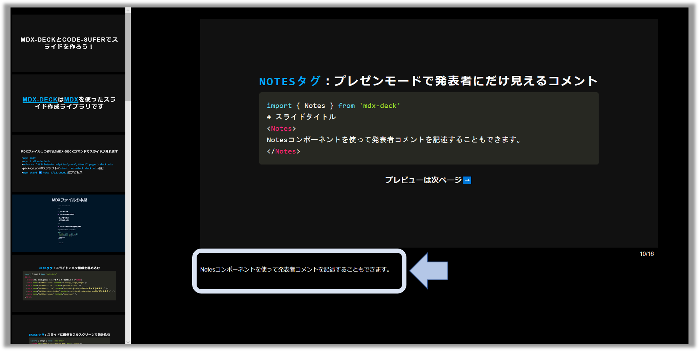

export { default as theme } from './theme'
import { Appear, Head, Notes, } from 'mdx-deck'
import { Invert, Split, FullScreenCode, Horizontal} from 'mdx-deck/layouts'
import { CodeSurfer } from 'mdx-deck-code-surfer'
import nightOwl from 'prism-react-renderer/themes/nightOwl'
import Box from 'superbox'
import Counter from './components/counter'


<Head>
  <title>mdx-deckとcode-suferでスライドを作ろう！</title>
  <meta name='twitter:card' content='summary_large_image' />
  <meta name='twitter:site' content='@inouetakumon' />
  <meta name='twitter:title' content='mdx-deckとcode-suferでスライドを作ろう！' />
  <meta name='twitter:description' content='mdxファイルを作るだけでプレゼンテーション可能なmdx-deckの紹介と、そのプラグインであるcode-suferを使ったリッチなソースコードプレビューを紹介します' />
  <meta name='twitter:image' content='card.png' />
</Head>


# mdx-deckとcode-suferでスライドを作ろう！

---

# [mdx-deck](https://github.com/jxnblk/mdx-deck)は[mdx](https://github.com/mdx-js/mdx)を使ったスライド作成ライブラリです

---

### mdxファイル１つ作ればmdx-deckコマンドでスライドが見れます

* `npm init`
* `npm i -D mdx-deck`
* `echo -e "#Title\\ndescription\\n---\\n#Next" page > deck.mdx`
* package.jsonのスクリプトに`start: mdx-deck deck.mdx`追記
* `npm start` :arrow_right: `http://127.0.0.1`にアクセス

---


<CodeSurfer
  title='MDXファイルの中身'
  lang='markdown'
  theme={nightOwl}
  dark={true}
  code={require('!raw-loader!./snippets/sample-slide.mdx')}
  steps={[
    { notes: ''},
    { notes: 'ファイルの拡張子はmdxです'},
    { lines: [1, 5, 7, 9, 10, 11], notes: '通常のマークダウン記法を使えます' },
    { range: [17, 23], notes: 'Reactコンポーネントも埋め込むことができます' },
    { lines: [3, 13, 24], notes: '---でスライドの改ページができます' },
    { notes: ''},
  ]}  
/>

---

### `Headタグ`：スライドにメタ情報を埋め込む

```jsx
import { Head } from 'mdx-deck'
<Head>
  <title>mdx-deckとcode-suferでスライドを作ろう！</title>
  <meta name='twitter:card' content='summary_large_image' />
  <meta name='twitter:site' content='@inouetakumon' />
  <meta name='twitter:title' content='mdx-deckとcode-suferでスライドを作ろう！' />
  <meta name='twitter:description' content='mdx-deckとcode-suferでスライドを作ろう！' />
  <meta name='twitter:image' content='card.png' />
</Head>
```

---

### `Imageタグ`：スライドに画像をフルスクリーンで読み込む


```jsx
import { Image } from 'mdx-deck'
<Image src='./images/sample-background.jpg' size='cover'/>
```

#### プレビューは次ページ:arrow_right:
---

import { Image } from 'mdx-deck'

<Image src='./images/sample-background.jpg' size='cover'/>

---

### `Appearタグ`：一行ごとに表示する

```jsx
import { Appear } from 'mdx-deck'
<ul>
  <Appear>
    <li>ほっぷ</li>
    <li>すてっぷ</li>
    <li>じゃんぷ</li>
  </Appear>
</ul>
```

#### プレビューは次ページ:arrow_right:
---

### `Appearタグ`プレビュー 

<ul>
  <Appear>
    <li>ほっぷ</li>
    <li>すてっぷ</li>
    <li>じゃんぷ</li>
  </Appear>
</ul>

---


### `Notesタグ`：プレゼンモードで発表者にだけ見えるコメント 

```jsx
import { Notes } from 'mdx-deck'
# スライドタイトル
<Notes>
Notesコンポーネントを使って発表者コメントを記述することもできます。
</Notes>

#### プレビューは次ページ:arrow_right:
---



---

### Reactコンポーネントも埋め込むことができます

##### `+`   と   `-`   をクリックしてみましょう
<div style={{
  display: 'flex',
  alignItems: 'center'
}}>
<Counter/>
</div>

---
export default Split


## スプリットレイアウト

---
export default Horizontal


### ホリゾンタルレイアウト

---
export default Invert

# 色反転レイアウト

---
export default FullScreenCode

```jsx
<Button>
  ソースコードをフルスクリーン表示
</Button>
```
---
## Code Surferで色々できます

# <🏄/>

code-surferはmdx-deckで使えるReactコンポーネントです。<br />
ソースコードプレビューをリッチにしてくれます。<br />

###### 参考：https://github.com/pomber/code-surfer


---
<CodeSurfer
  title="Code Surferでできること"
  code={require("!raw-loader!./snippets/my-snippet.js")}
  showNumbers={true}
  theme={nightOwl}
  lang="javascript"
  dark={true}
  steps={[
    { notes: ''},
    { lines: [13], notes: '1. linesで行をハイライト＆ズームできます。' },
    { lines: [15], notes: '2. rangeで範囲指定も可能です。' },
    { range: [5, 10], notes: 'こんな感じ😀' },
    { lines: [17], notes: '3. tokensで単語文字に絞ることも可能です。' },
    { tokens: {17: [18] }, notes: 'こんな感じ😁' },
    { lines: [6], notes: '4. row-loaderと併用して他ファイルからコードを読み込んだり ...' },
    { lines: [7], notes: '5. 行番号を振ったり ...' },
    { lines: [8], notes: '8. テーマ指定も可能です！　参考：https://code-surfer.netlify.com/theming' },
    { notes: ''},
  ]}
/>
---
# :tomato:おしまい:tomato:
