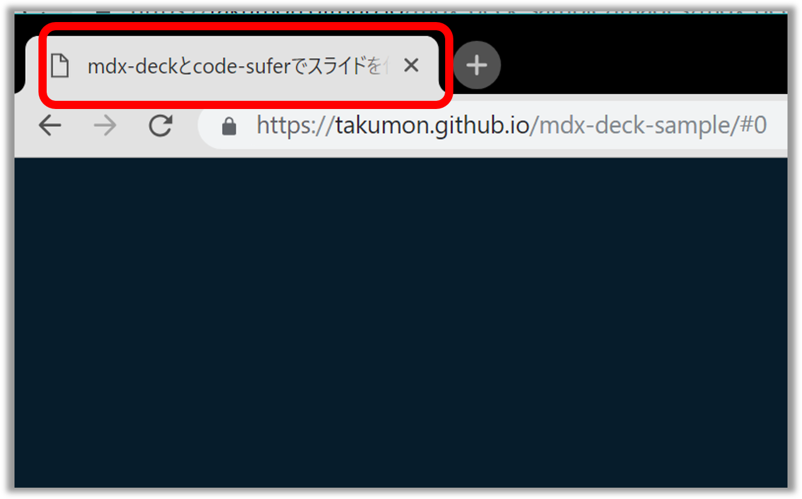

export { default as theme } from './components/theme'
import { Appear, Head, Notes, Image} from 'mdx-deck'
import { Invert, Split, FullScreenCode, Horizontal} from 'mdx-deck/layouts'
import { CodeSurfer } from 'mdx-deck-code-surfer'
import nightOwl from 'prism-react-renderer/themes/nightOwl'
import Box from 'superbox'
import styled from 'styled-components'
import {
  BGImage,
  Counter,
  LayoutMarkdown,
  LayoutAlignCenter,
  IFRAME,
  Sm,
} from './components'


<Head>
  <title>mdx-deckとcode-suferでスライドを作ろう！</title>
</Head>


<h1>
  <span>MDX-DECK</span><Sm>と</Sm><span>Code Sufer</span><Sm>で</Sm><br/>
  <span>スライドを作ろう！</span>
</h1>

<hr/>

###### [@inouetakumon](https://twitter.com/inouetakumon):tomato:

###### このスライドのソースは[コチラ](https://github.com/Takumon/mdx-deck-sample)

<hr/>

---

### 自己紹介
<hr/>
<br/>


* 名前：たくもん（[@inouetakumon](https://twitter.com/inouetakumon)）
* 仕事：SIer
* 言語：Java、JavaScript
* 趣味：ブログ（[https://takumon.com](https://takumon.com)）

---
export default LayoutAlignCenter

### [Takumon Blog :tomato:](https://takumon.com)

<small>ブログはGatsbyJS製。週１で更新してます。</small>

<iframe 
  style={{
    width: '90vw',
    height: '75vh',
    background: 'white',
  }}
  src={'https://takumon.com'}
  ></iframe>

---

ここから本題

---
export default LayoutMarkdown

##  スライド作成ツールはいろいろあるけれど...
<hr/>
<br/>

* PowerPoint
* Keynote
* [Reveal.js](https://revealjs.com/)
* [Remark.js](https://remarkjs.com/)

---

#### MDX-DECKは[MDX](https://github.com/mdx-js/mdx)ベースのスライド作成Node.jsライブラリ


---
export default LayoutMarkdown

##  MDX-DECKとは
<hr/>
<br/>

1. [MDX](https://github.com/mdx-js/mdx)ベースのスライド作成ライブラリ
1.  設定ファイルなしでMDXファイルだけでスライドが作れる
1. MDXはMarkdownにJSXを書けるようにしたもの
1. Reactコンポーネントの力を借りてリッチなスライドが作れる
1. 強力なソースコードプレビュー用プラグイン(Code-Surfer)が用意されている


---

export default LayoutMarkdown

## [MDX](https://github.com/mdx-js/mdx)ファイル１つ作ればスライドが完成

<hr/>
<br/>


1. npm i -D mdx-deck
1. MDXファイル作成
1. package.jsonに起動スクリプト追加
1. npm start
1. `http://127.0.0.1:8080` にアクセス！

---
export default LayoutAlignCenter


<CodeSurfer
  title={() => (<h2>サンプル<span style={{color: '#f46f55'}}>.mdx</span></h2>)}
  lang='markdown'
  theme={nightOwl}
  dark={false}
  code={require('!raw-loader!./snippets/sample-slide.mdx')}
  steps={[
    { notes: ''},
    { notes: () =>  (<h3>ファイルの拡張子は<span style={{color: '#f46f55'}}>.mdx</span></h3>)},
    { range: [5, 9], notes: () =>  (<h3>マークダウン記法が使える</h3>) },
    { range: [15, 23], notes: () =>  (<h3>Reactコンポーネントも使える</h3>) },
    { lines: [3, 11, 23], notes: () => (<h3><span style={{color: '#f46f55'}}>---</span>で改ページ</h3>) },
    { notes: ''},
  ]}  
/>


---

export default LayoutAlignCenter

<BGImage  opacity={1} src={require("file-loader!./images/themes.png")}/>

---

export default LayoutAlignCenter

<BGImage  opacity={0.3} src={require("file-loader!./images/themes.png")}/>


# 豊富なテーマ


```jsx
export { dark as theme } from 'mdx-deck/themes'
```

###### 参考：https://github.com/jxnblk/mdx-deck/blob/master/docs/themes.md


---
export default LayoutMarkdown

## 🔧 スライド用のコンポーネント
<hr/>
<br/>


1. 画像の全画面表示
1. 左右分割レイアウト
1. 横並びレイアウト
1. 色反転レイアウト
1. ソースコードの全画面表示
1. アニメーション
1. メタ情報埋め込み
---

export default LayoutAlignCenter

## `Image`：画像の全画面表示 

```jsx
import { Image } from 'mdx-deck'
<Image src='./images/sample-background.jpg' size='cover'/>
```

#### プレビューは次ページ:arrow_right:


---

<Image src='./images/sample-background.jpg' size='cover'/>


---

export default LayoutAlignCenter

## `Split`：左右分割レイアウト

```jsx
import { Split } from 'mdx-deck/layouts'
export default Split


## スプリットレイアウト
ほげほげふがふがぴよぴよ
```

#### プレビューは次ページ:arrow_right:

---
export default Split


## スプリットレイアウト

ほげほげふがふがぴよぴよ


---

export default LayoutAlignCenter

## `Horizontal`：横並びレイアウト

```jsx
import { Horizontal} from 'mdx-deck/layouts'
export default Horizontal


### どんどん横に並んでいく

```

#### プレビューは次ページ:arrow_right:


---
export default Horizontal


## どんどん横に並んでいく


---

export default LayoutAlignCenter

## `Invert`：色反転レイアウト

```jsx
import { Invert} from 'mdx-deck/layouts'
export default Invert

## 色反転レイアウト
```

#### プレビューは次ページ:arrow_right:

---
export default Invert

## 色反転レイアウト


---

## `FullScreenCode`：ソースコードの全画面表示

````jsx
import { FullScreenCode } from 'mdx-deck/layouts'
export default FullScreenCode


```jsx
import Box from 'superbox'

<Box
  fontSize={80} px={3} py={4}
  color='white' bg='pink'>
  superbox
</Box>
```
````

#### プレビューは次ページ:arrow_right:

---
export default FullScreenCode

```jsx
import Box from 'superbox'

<Box
  fontSize={80} px={3} py={4}
  color='white' bg='pink'>
  superbox
</Box>
```


---

## `Appear`：アニメーション

```jsx
import { Appear } from 'mdx-deck'

### `Appear`

<ul>
  <Appear>
    <li>ほっぷ🐣</li>
    <li>すてっぷ🐤</li>
    <li>じゃんぷ🐓</li>
  </Appear>
</ul>
```

#### プレビューは次ページ:arrow_right:
---

## `Appear`

<ul>
  <Appear>
    <li>ほっぷ🐣</li>
    <li>すてっぷ🐤</li>
    <li>じゃんぷ🐓</li>
  </Appear>
</ul>


---

## `Headタグ`：メタ情報埋め込み

```jsx
import { Head } from 'mdx-deck'
<Head>
  <title>mdx-deckとcode-suferでスライドを作ろう！</title>
</Head>
```

#### プレビューは次ページ:arrow_right:

---



---
export default LayoutMarkdown

## 🎬 プレゼンテーション機能
<hr/>
<br/>

* 💁🏻‍♂️ プレゼンモード `Option + P`
* 📓 オーバービューモード `Option + O`
* 📚 全ページ表示モード `Option + G`


<Appear>
  <h2 >実際にお見せします💁🏻‍♂️</h2>
</Appear>

```notes
スライドには表示されませんが、発表者にだけ見えるノートです。
発表時の話の要点をここに書いたりしてチラ見できます。
```


---

## 自作Reactコンポーネントも埋め込める

スライドでよく使う部品をコンポーネント化して再利用できる

<Counter />


---

export default Split


## 🏄 MDX-DECKのプラグイン
<hr/>
<br/>

* ソースコードプレビューをリッチにしてくれる
* 大量のコードでも説明したい箇所をズームにできる
* アニメーションを指定できる
* アニメーションごとに説明文を付けられる


---
<CodeSurfer
  title="Code Surferでできること"
  code={require("!raw-loader!./snippets/my-snippet.js")}
  showNumbers={true}
  theme={nightOwl}
  lang="javascript"
  dark={true}
  steps={[
    { notes: ''},
    { lines: [13], notes: ()=>(<h2>1. linesで行をハイライト＆ズームできます。</h2>)},
    { lines: [15], notes: ()=>(<h2>2. rangeで範囲指定も可能です。</h2>) },
    { range: [5, 10], notes: ()=>(<h2>こんな感じ😀</h2>) },
    { lines: [17], notes: ()=>(<h2>3. tokensで単語文字に絞ることも可能です。</h2>) },
    { tokens: {17: [18] }, notes: ()=>(<h2>こんな感じ😁</h2>) },
    { lines: [6], notes: ()=>(<h2>4. row-loaderと併用して他ファイルからコードを読み込んだり ...</h2>) },
    { lines: [7], notes: ()=>(<h2>5. 行番号を振ったり ...</h2>) },
    { lines: [8], notes: ()=>(<h2>8. テーマ指定も可能です！　参考：https://code-surfer.netlify.com/theming</h2>) },
    { notes: ''},
  ]}
/>


---

export default LayoutAlignCenter

### [mdx-deck-live-code 🤯](https://github.com/JReinhold/mdx-deck-live-code)

<small>Reactコンポーネントのライブコーディングができるプラグイン</small>

<iframe 
  style={{
    width: '90vw',
    height: '75vh',
    background: 'white',
  }}
  src={'https://mdx-deck-live-code.netlify.com/#10'}
  ></iframe>


---

export default LayoutMarkdown

## 🚂 使ってみた感想
<hr/>
<br/>

### ✨ Good !!
* 簡単なスライドはMDXファイル１つで作れる
* 良く使うデザインはReactコンポーネントとして共通化できる
* 全資産をNode.jsで管理できる

### 🤔 Uhnnn...
* 凝ったデザインにするにはテーマの調整（CSS）が必要
* 最終的にReactでスライド作ってるみたいになった...

---

export default LayoutMarkdown

## 👨‍👩‍👦‍👦  まとめ
<hr/>
<br/>

### 📓 MDX-DECK
* MDXファイルを作るだけで簡単にスライドが作成できる
* プレゼンテーション機能が一通りそろっている
* Reactコンポーネントの恩恵を受けられる

### 🏄 CODE-SURFER
* MDX-DECKのプラグイン
* ソースコードプレビューをリッチにしてくれる

<Appear>
<h1>MDX-DECKとCode Suferでスライドを作ろう！</h1>
</Appear>

---
# :tomato:おしまい:tomato:

##### 🙇 ご清聴ありがとうございました 🙇
###### このスライドのソースは[コチラ](https://github.com/Takumon/mdx-deck-sample)


---

export default LayoutMarkdown

## 📋 参考資料

##### ・ [MDX](https://mdxjs.com/)
##### ・ [jxnblk/mdx-deck: MDX-based presentation decks](https://github.com/jxnblk/mdx-deck)
##### ・ [JReinhold/mdx-deck-live-code: A component for mdx-deck to live code in your slides. 🤯](https://github.com/JReinhold/mdx-deck-live-code)
##### ・ [pomber/code-surfer: React component for scrolling, zooming and highlighting code samples <🏄/>](https://github.com/pomber/code-surfer)
##### ・ [kentcdodds/simply-react](https://github.com/kentcdodds/simply-react)
##### ・ [SaraVieira/99-problems-graphql-aint-one: Talk for LvivJS 2018](https://github.com/SaraVieira/99-problems-graphql-aint-one)
##### ・ [Highlight, Scroll, & Zoom Code Snippets in mdx-deck with Code Surfer <🏄/> · Manorisms](https://elijahmanor.com/code-surfer/)

